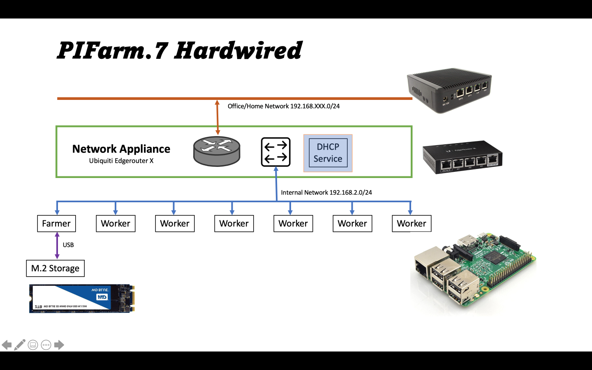

<H1>PiFarmAnsible Scripts</H1>   

## Introduction

Use this to configure a Raspberry Pi Cluster with one mangement node (the Farmer) and the others doing tasks (the Workers).
This work is based on the [RaspiFarm](https://raspi.farm/) work by two students from Switzerland.   The idea is is old and works quite
well, and I am grateful for them showing me how to do it with Pi's.   I happened on their work when I was curious about how to build a farm with commodity single board computers. Raspberry Pi's have been an cost effective way to assemble a bare metal cluster, so off I went to amazon. It was on the RaspiFarm site I got to learn about [ansible](https://www.ansible.com/).  I had started working with Puppet at the beginning of the last decade and had used it satifactorally in a few projects.  The issue was always...I had to install ruby, and pupput AND teach others how to do ruby AND pupper.   I worked with an organziation that has been embrasing python. Pythong was available everyplace I needed it. So this was an opportunity to learn more about ansible and python.  It's still a love-hate relationship, but it grows on me.  Best of all, other people wanted to make it work for them.

This project hosts my experiments of building a Pi Cluster into a working Computer farm by using ansible.  It is far from perfect, but it it working well (for me).  I can take a default download of the [Raspberry Pi OS](https://www.raspberrypi.org/software/operating-systems/), connect them with a simple network appliance, and use these ansibles scripts to configure bare metal cluster.  I have done this many times with a VMs, but always seem to have issues with bare metal.

## Sample PiFarms

###  The network appliance

Ubiquiti Edgerouter X

###  Farm types

The two types

####  The 7 Pis where the farmer has an M.2 disk

NFS

####  The 4 Pis with no disk

### Configuring you home router hints.

Pfsense instructions

## Steps
- Edit the farm.yml to set infrastructure variables. (details pending)
- On the Farmer node download ansible and create the ssh keys  (./bin/init_ssh)
- Push the keys to all the  WorkerNodes  (ansible-playbook -u pi -k initialize_cluster.yml)
- (Optional) Gather all the ansible facts into a folder (ansible-playbook get-facts.yml)
- Then initialize the farmer and workers (in no particular order by
  - ansible-playbook initialize_workers.yml
  - ansible-playbook initialize_farmer.yml
  - Setup a granafa monitor on the farmer (ansible-playbook monitor-cluster)
- test the cluster (ansible-playbook  run-sysbench)

## Optional playbooks

the debugs, dumps, ... .

## Configuration

This will be high level and break into deeper details

## Future work

More later, this is starting the documention off.
