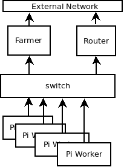

<H1>PiFarmAnsible Scripts</H1>   

## Introduction

Use this to configure a Raspberry Pi Cluster with and external mangement node (the Farmer) and connected group of Raspberry Pi's doing tasks (the Workers).
This work is based on the [RaspiFarm](https://raspi.farm/) work by two students from Switzerland. The idea is is old and works quite
well, and I am grateful for them showing me how to do it with Pi's. I happened on their work when I was curious about how to build a cluster with commodity single board computers.  Raspberry Pi's have been an cost effective way to assemble a bare metal cluster, so off I went to amazon. 

It was on the RaspiFarm site I got to learn about [ansible](https://www.ansible.com/).  Earliers in my career had started working with Puppet and have used it satifactorally in a few projects.  The issue was always...I had to install ruby, and puppet AND teach others how to do ruby AND puppet. I worked with an organziation that has been embrasing python. Python was available everyplace I needed it. So this was an opportunity to learn more about ansible and python.  It's still a love-hate relationship, but it grows on me.  Best of all, other people wanted to make it work for them.</p>

This project hosts my experiments of building a Pi Cluster into a working Computer farm by using ansible.  It is far from perfect, but it it working well (for me). I can take a default download of the [Raspberry Pi OS](https://www.raspberrypi.org/software/operating-systems/), connect them with a simple network appliance, and use these ansibles scripts to configure bare metal cluster. I have done this many times with a VMs, but always seem to have issues with bare metal.</p>

## Sample PiFarms

###  The network appliance

Any old switch and or firewall.

###  Farm types

External Services (ansible, dhcp, [dns)], with or without a gateway.  Then a cluster of rasperry pi workers.
Current I am using dnsmasq to do DHCP.

### Reference Network Diagram

The Farmer is multi-homed.  Do not put a gateway on it.  

The Pi's only know their private nework and have the router internal address as their gateway.



## Steps

Prior to pulling this file on Centos8 install git  "dnf install git-all -y"

- Edit the farm.yml to set infrastructure variables. A sample is given below.
- (Optional) On the Farmer node download ansible and create the ssh keys  (./bin/init_ssh)
- Create the Lab Users and push the Farmer key to all the Pi Worker nodes. You will need to do this at you pi's user/password  (my images: pi/pifarm)
  - ```ansible-playbook -e ansible_user=pi -k initialize_cluster-workers.yml```
- Setup the ssh known_hosts by doing:
  - ```ansible-playbook initialize-known-hosts.yml```
- (Optional) Gather all the ansible facts into a folder
  - ```ansible-playbook get-facts.yml```
- Then initialize the farmer and workers:
  - ```ansible-playbook initialize_workers.yml```
  - ```ansible-playbook initialize_farmer.yml```
- (Optional) Setup a granafa monitor on the farmer:
  - ```ansible-playbook monitor-cluster.yml```
- (Optional) test the cluster using sysbench:
  - ```ansible-playbook  run-sysbench.yml```

## Optional playbooks

Dump Ansible Host Variables (host-vars)
```
ansible-playbook dump-hostvars.yml
```
Shutdown the farm worker nodes
```
ansible-playbook shutdown-farm.yml
```
Reboot the farm worker nodes
```
ansible-playbook reboot-farm.yml
```
Update the Pi firmware the farm worker nodes
```
ansible-playbook update-firmware.yml
```
Stop Bluetooth and WiFi on the farm worker nodes.  Currently I don't enable, but just in case.
```
ansible-playbook stop-wireless
```
## Inventory

```yml
---

# This is the PiFarm Inventory and variables file.
# This file along with all those in the "group_vars" directory will
# set all the controlling variables for the ansible scripts

# There are two main sections "workers"  and "farmer".
# First in are two dictionary variables of "host" and their associated "vars"

workers:
  hosts:
    pi-101:
      ansible_host: 192.168.102.110
      pifarm_hostname: pi-101
    pi-102:
      ansible_host: 192.168.102.122
      pifarm_hostname: pi-102
    pi-103:
      ansible_host: 192.168.102.111
      pifarm_hostname: pi-103
    pi-104:
      ansible_host: 192.168.102.108
      pifarm_hostname: pi-104
  
  # vars for all workers are in this section.
  vars:

    # ... this is the farms public ssh key
    # this is crude and needs to be better set as sometimes 
    # I don't want to use the users ssh keys, but ones setup
    # for this task.
    remote_user_ssh: "/home/lavender/.ssh/id_rsa.pub"

    # ... this is the pi user which will be used
    # This user will be setup. I don't like to use the default user ('pi')
    # This user has no password, so it is only usable via ssh.
    home_dir: /home/lab
    remote_user: lab
    remote_group: lab
    
    # ... this is the user to connect to the pifarm for ansible scripts
    # This seems crude, but I am not sure how to specify it any other way.
    ansible_user: lab

    # ... Is this lab connected to the internet so I can update?
    # If there is no gateway to the internet, then set this to False.
    # As my default boot image grow older, this is desired.
    pifarm_connected_internet: True

# The farmer is a "master" concept.  For not it is a single machine, but
# in the furture it could be more.
# Notice how the ansible_user is set on the host level and not the common level.

farmer:
  hosts:
    pi-farmer:
      ansible_host: 192.168.102.1
      pifarm_hostname: farmer
      ansible_user: lavender
  vars:
    # ... define controlling user.
    local_user: lavender
    local_group: lavender
    home_dir: /home/lavender

    # ... pifarm services (on farmer)
    # What services to setup on the farmers
    export_nfs_share: false
    pifarm_install_prometheus: false
    pifarm_install_dnsmasq: false

    # ... networking (not used today)
    # It is set on the PiFarm workers via the DHCP server (dnsmasq or ubiquiti router)
    router_ip: 192.168.102.2
`````` 

## Future work

More later, this is starting the documention off.
